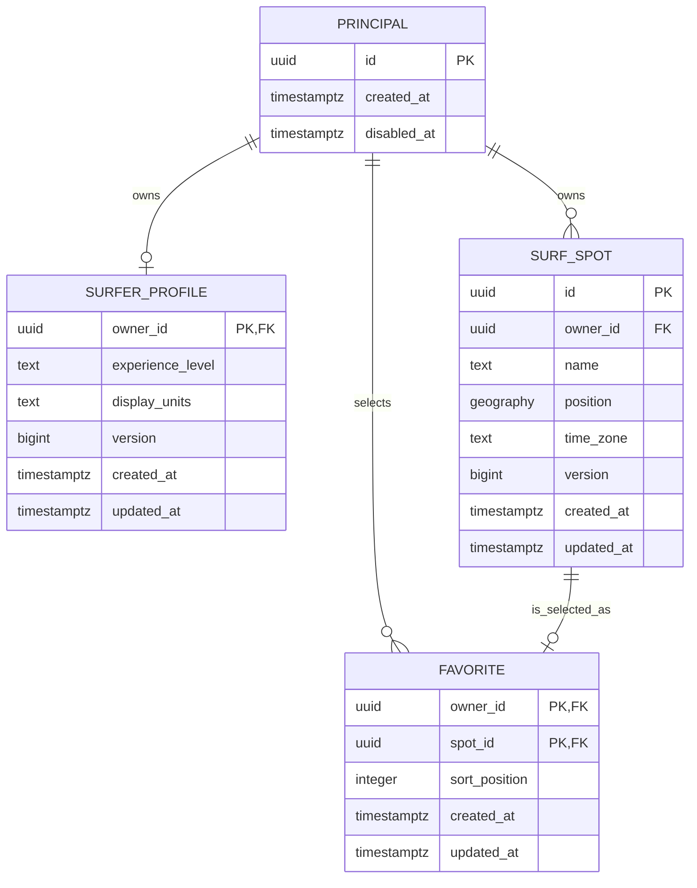

# Initial Domain and Data Model

## Scope

This model defines the first user-owned capability: a principal has one surfer profile, owns private surf spots, and chooses favorites. It establishes the seams needed by forecast ingestion without fixing a provider schema before issue #11 or a preference vocabulary before issue #15.

The relational model is a contract for issue #18, not an executable migration. Migration-tool and driver selection remain implementation decisions within the constraints of [ADR 0004](../adr/0004-use-postgresql-and-postgis.md), [ADR 0013](../adr/0013-enforce-user-ownership-with-postgresql-row-level-security.md), and [ADR 0014](../adr/0014-use-forward-only-sql-migrations-and-use-case-transactions.md).

## Domain boundaries

### Identity and access

`Principal` is the internal identity handle used for ownership and authorization. Bootstrap mode resolves one stable principal at the server boundary. Authentication adapters may later map verified external identities to that handle.

Identity does not contain surf skill or preference data.

### Surfer profile

`SurferProfile` describes recommendation-relevant characteristics for one principal. Its initial persisted attributes are:

- experience level;
- display unit system;
- optimistic concurrency version;
- creation and update timestamps.

Experience level is an input to suitability, never proof that conditions are safe. Canonical measurements remain SI regardless of display preference.

Condition thresholds, boards, and per-spot preferences are intentionally deferred until issue #15 defines their scoring meaning. Adding unconstrained fields before that decision would make stored values impossible to interpret or reproduce reliably.

### Surf spot

`SurfSpot` is a private, user-owned representation of a break. It has a stable identity, owner, name, display position, IANA time-zone identifier, optimistic concurrency version, and timestamps.

Ownership is immutable. Renaming or moving a spot updates the aggregate version. Position uses WGS 84 longitude/latitude represented by PostGIS `geography(Point, 4326)`.

### Favorite collection

`Favorite` is an owner-scoped relationship to a surf spot. It initially carries a non-negative sort position and timestamps. Removing a favorite does not delete its surf spot.

The database must prove that the favorite and referenced spot have the same owner. Application authorization alone is insufficient for that invariant.

### Forecast ingestion seam

`ForecastPoint` is a provider-specific sampling location, not a property of `SurfSpot`. The future ingestion model will record provider, model, grid or location key, sampling position, selection algorithm version, and validity interval. A versioned mapping will explain which forecast points informed a spot recommendation.

The first transactional schema does not create forecast tables. Issue #11 selects the provider contract, and issue #9 will add the ingestion schema without changing private spot identity.

## Relationship model



## Relational constraints

The first migration must encode at least these invariants:

| Invariant | Database enforcement |
| --- | --- |
| One profile per principal | `surfer_profiles.owner_id` is both primary key and foreign key |
| Every user row has an owner | non-null owner columns |
| Favorite references an owned spot | composite foreign key from `(spot_id, owner_id)` to a unique `(id, owner_id)` spot key |
| No duplicate favorite | primary key on `(owner_id, spot_id)` |
| Stable favorite order input | non-negative `sort_position`; duplicate positions are allowed and resolved by spot ID for deterministic display |
| Valid canonical position | non-null WGS 84 geography point |
| Usable local-time conversion | non-empty IANA time-zone identifier, validated by the application and migration tests |
| Supported experience vocabulary | checked text value; avoid a PostgreSQL enum so vocabulary changes remain ordinary migrations |
| Lost-update protection | positive aggregate `version`, incremented by compare-and-swap updates |
| Ownership isolation | RLS policies compare `owner_id` with the transaction-local principal |

Name length, whitespace normalization, supported time zones, and experience transitions are validated in the domain and repeated as practical database checks. Database errors are translated at the adapter boundary rather than exposed through HTTP.

## Canonical representation

- Persist instants as UTC `timestamptz`; use a spot's IANA zone only for local display and daylight-saving conversion.
- Persist distance and wave height in metres, speed in metres per second, periods in seconds, and directions as degrees clockwise from true north in `[0, 360)`.
- Convert provider units during normalization and user units at presentation boundaries.
- Never use floating-point equality as a domain identity or deduplication key.

## Aggregate lifecycle

- Creating a principal and its first profile is one application transaction.
- Creating a spot does not automatically make it a favorite; the UI may request both operations in one use case.
- Removing a favorite preserves the spot.
- Deleting an unreferenced private spot removes its favorite relationship in the same transaction.
- Forecast and recommendation records will retain immutable input snapshots or provenance references rather than depending on the current mutable spot row.
- Soft deletion is not part of the initial model. It would require every query, unique constraint, and RLS policy to understand a hidden lifecycle state. Archival can be introduced when a concrete retention requirement exists.

## Application and repository boundaries

The application layer owns transaction scope. A use case conceptually executes as:

```text
resolve trusted principal
  └─ begin transaction
       ├─ set transaction-local principal for RLS
       ├─ load and change domain aggregates through narrow repositories
       ├─ persist with expected aggregate version
       └─ commit or roll back
```

Initial ports should be capability-specific rather than generic CRUD abstractions:

- profile creation, retrieval, and compare-and-swap update;
- spot creation, owner-scoped retrieval/listing, compare-and-swap update, and explicit deletion;
- favorite add, deterministic listing/reordering, and removal.

Repositories do not begin or commit transactions, infer the acting owner, return SQL rows as domain models, or expose an unscoped list operation.

## Error and disclosure semantics

- Invalid domain input is distinguishable from a version conflict.
- A resource absent for the acting owner is reported as not found; the API does not reveal whether it belongs to another principal.
- A missing trusted principal fails before a user-data transaction begins.
- Exact coordinates, database statements containing coordinate values, and raw persistence errors are excluded from routine logs.

## Deferred decisions

- Authentication protocol, session management, and account recovery.
- Forecast provider and canonical forecast schema.
- Board/equipment model and condition-preference vocabulary.
- Spot transformation and recommendation persistence.
- Shared catalog, publication, collaboration, and moderation.
- Retention rules once session feedback and recommendation history exist.
